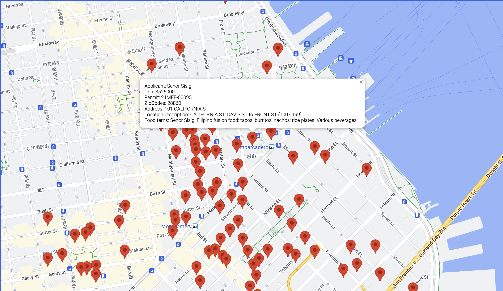

# Gourment-World

Help everyone find their favorite restaurant.



# How To Start

```shell
docker-compose up -d
```

# Project Introduction
The backend is developed using SpringBoot, and the Java version is 1.8. Gourmet data is read from a CSV file into memory; since the data volume is not large, it can be entirely stored in memory. Then, interfaces are provided for frontend invocation and display.

The frontend uses the React framework, with Node version 16. Interface requests are made using axios. Gourmet data is displayed using Google Maps, utilizing the Marker and InfoWindow components of Google Maps for presentation.

Both the frontend and backend are deployed using Docker, with Dockerfiles employing multi-stage builds to minimize dependencies on the host environment.

Finally, deployment is achieved using docker-compose, creating a network to facilitate the nginx container in forwarding backend requests to the Server container.

# Optimization
- Currently, the data is hardcoded in a CSV file, but it can be changed to real-time data from the cloud in the future.
- Add a search box to the page, allowing users to locate places by searching for food.
- Use Redis Geo for geographic searches to enable searching for nearby gourmet food.
